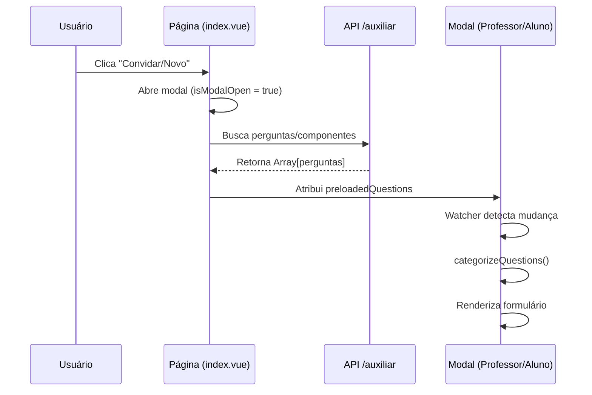

# Renderização Dinâmica de Formulários - Modais de Usuários

## Visão Geral

Este documento detalha a implementação e correção do sistema de renderização dinâmica de formulários nos modais de gerenciamento de usuários (`ModalGerenciarProfessor` e `ModalGerenciarAluno`). O sistema permite que campos de formulário sejam configurados dinamicamente através de perguntas armazenadas no banco de dados, proporcionando flexibilidade para adicionar ou modificar campos sem alterações no código.

## Contexto

### Arquitetura do Sistema

O sistema utiliza uma arquitetura de três camadas:

1. **Backend (BFF - Backend for Frontend)**: Endpoint `/api/usuarios/auxiliar` que retorna perguntas e componentes configurados
2. **Componente Pai** (`pages/usuarios/index.vue`): Gerencia a busca de dados e passagem de props
3. **Componentes Modais**: Renderizam formulários dinâmicos baseados nos dados recebidos

### Fluxo de Dados



## Problema Identificado

### Sintomas

- Campos dinâmicos (CPF, RG, Nascimento, etc.) exibiam "Campo não configurado"
- O formulário não era renderizado corretamente
- Dados do BFF chegavam corretamente mas não eram processados

### Causa Raiz

O problema era uma **condição de corrida (race condition)** com três componentes:

1. **Timing de Inicialização**: O componente pai atribuía dados às props ANTES de abrir o modal
2. **Reatividade do Vue**: Watchers só disparam em MUDANÇAS, não em valores iniciais
3. **Watcher Incorreto**: Uso de `{ immediate: true }` causava erros na inicialização

## Solução Implementada

### 1. Reordenação do Fluxo (CRÍTICO)

**Arquivo:** `pages/usuarios/index.vue`

**Mudança:** Abrir o modal ANTES de atribuir os dados

```javascript
const handleNew = async () => {
  // Limpar dados anteriores
  modalQuestions.value = []
  modalComponents.value = []
  
  // 🔑 CRÍTICO: Abrir modal PRIMEIRO
  selectedItem.value = null
  isModalOpen.value = true  // Modal criado com props vazias

  try {
      // Buscar dados do BFF
      const [perguntas, componentes] = await Promise.all([
          $fetch('/api/usuarios/auxiliar', {...}),
          $fetch('/api/usuarios/auxiliar', {...})
      ])
      
      // Atribuir DEPOIS - dispara o watcher
      modalQuestions.value = perguntas || []
      modalComponents.value = componentes || []
  }
}
```

**Por quê funciona:**
- Modal é criado com `preloadedQuestions = []`
- Quando `modalQuestions.value` é atribuído, o watcher detecta a MUDANÇA de `[]` para `[...perguntas]`
- Isso dispara `fetchAuxiliaryData()` e `categorizeQuestions()`

### 2. Watcher para Dados Precarregados

**Arquivos:** `ModalGerenciarProfessor.vue`, `ModalGerenciarAluno.vue`

**Adição:** Novo watcher para detectar chegada de dados

```javascript
watch(() => props.preloadedQuestions, async (newQuestions) => {
    if (props.isOpen && newQuestions && newQuestions.length > 0) {
        console.log('[ModalProfessor] Preloaded questions arrived, re-fetching')
        await fetchAuxiliaryData()
    }
}, { deep: true })
```

**Configuração:**
- `deep: true`: Detecta mudanças profundas no array
- Condição `props.isOpen`: Só processa se modal estiver aberto
- Condição `newQuestions.length > 0`: Ignora limpezas de array

### 3. Remoção de `immediate: true`

**Arquivos:** `ModalGerenciarProfessor.vue`, `ModalGerenciarAluno.vue`

**Mudança:** Remover flag que causava erro na montagem

```diff
watch(() => props.isOpen, async (newVal) => {
    if (newVal) {
        resetForm()
        await fetchAuxiliaryData()
        ...
    }
-}, { immediate: true })
+})
```

**Razão:** O `{ immediate: true }` fazia o watcher disparar com `isOpen = false` na montagem, causando erros no `resetForm()`.

### 4. Inicialização Correta de `formRespostas`

**Arquivos:** `ModalGerenciarProfessor.vue`, `ModalGerenciarAluno.vue`

**Mudança:** Inicializar ANTES de categorizar

```javascript
const fetchAuxiliaryData = async () => {
    // ... buscar perguntas ...
    
    // PRIMEIRO: Criar estrutura reativa
    const initialRespostas = {}
    ;(perguntas || []).forEach(p => {
         initialRespostas[p.id] = { resposta: '', tipo: p.tipo }
    })
    formRespostas.value = { ...initialRespostas, ...formRespostas.value }

    // DEPOIS: Categorizar (template já pode acessar formRespostas)
    categorizeQuestions(perguntas || [])
}
```

**Razão:** Evita erros de acesso a `undefined` quando o template tenta renderizar `v-model="formRespostas[slot.id].resposta"`

## Categorização de Perguntas

### Algoritmo

A função `categorizeQuestions` mapeia perguntas para "slots" predefinidos ou para uma lista geral:

```javascript
const categorizeQuestions = (perguntas) => {
    const slots = { rg: null, cpf: null, nascimento: null, ... }
    const gerais = []
    
    perguntas.forEach(p => {
        const text = (p.label || p.pergunta || '').toLowerCase()
        
        if (text.includes('rg')) slots.rg = p
        else if (text.includes('cpf')) slots.cpf = p
        else if (text.includes('nascimento')) slots.nascimento = p
        // ... mais matches ...
        else gerais.push(p)  // Não mapeado = vai para repeater
    })
    
    questionSlots.value = slots
    perguntasGerais.value = gerais
}
```

### Matching Flexível

- Usa `includes()` para busca parcial (ex: "CPF", "cpf", "Cpf")
- Fallback: `p.label || p.pergunta` (usa label, senão slug)
- Case-insensitive: `.toLowerCase()`

## Renderização no Template

### Campos com Slots

```vue
<div v-if="questionSlots.cpf">
    <label>CPF</label>
    <input v-model="formRespostas[questionSlots.cpf.id].resposta" />
</div>
```

### Campos Dinâmicos (Repeater)

```vue
<div v-for="p in perguntasGerais" :key="p.id">
    <label>{{ p.label || p.pergunta }}</label>
    
    <!-- Select para tipo 'opcao' -->
    <select v-if="p.tipo === 'opcao'" v-model="formRespostas[p.id].resposta">
        <option v-for="o in p.opcoes" :value="o">{{ o }}</option>
    </select>
    
    <!-- Input de data -->
    <input v-else-if="p.tipo === 'data'" type="date" 
           v-model="formRespostas[p.id].resposta" />
    
    <!-- Input padrão -->
    <input v-else v-model="formRespostas[p.id].resposta" />
</div>
```

## Estrutura de Dados

### Pergunta (do BFF)

```typescript
interface Pergunta {
    id: string                    // UUID da pergunta
    pergunta: string              // Slug (ex: "cpf", "data_nascimento")
    label: string                 // Rótulo exibido (ex: "CPF", "Data de Nascimento")
    tipo: string                  // "texto" | "data" | "opcao" | "numero"
    opcoes: string[] | null       // Opções para tipo "opcao"
    obrigatorio: boolean          // Se campo é obrigatório
    ordem: number                 // Ordem de exibição
}
```

### FormRespostas (Reativo)

```typescript
interface FormRespostas {
    [perguntaId: string]: {
        resposta: string          // Valor do campo
        tipo: string              // Tipo do campo
        id_resposta?: string      // ID se já existe no banco
    }
}
```

## Debugging

### Console Logs

O sistema inclui logs para facilitar debugging:

```
[UsersPage] handleNew clicked. Tab: professores
[UsersPage] Fetching Professor data...
[UsersPage] Professor Data Loaded: {perguntas: Array(16), ...}
[ModalProfessor] Preloaded questions arrived, re-fetching
[ModalProfessor] Using preloaded data. Count: 16
[ModalProfessor] Categorizing 16 questions
[ModalProfessor] Slots assigned: rg, cpf, nascimento, genero, ...
```

### Verificação Visual

- ✅ Campos renderizam como inputs funcionais
- ✅ Placeholders aparecem corretamente (ex: "000.000.000-00" para CPF)
- ✅ Selects mostram opções quando aplicável
- ❌ "Campo não configurado" NÃO deve aparecer

## Limitações e Considerações

### Reatividade

- Props devem ser atribuídas APÓS o componente ser montado para disparar watchers
- `deep: true` necessário para arrays/objetos complexos
- Evitar `{ immediate: true }` em watchers que dependem de estado completo

### Performance

- `categorizeQuestions` é O(n) onde n = número de perguntas
- Matching usa `includes()` que é O(m) onde m = tamanho do texto
- Para grandes volumes, considerar memoização ou índices

### Manutenção

- Novos campos precisam ser adicionados a `questionSlots` e ao template
- Slugs de perguntas devem ser consistentes (ex: sempre "cpf", nunca "CPF" ou "Cpf")
- Tipos de campos suportados: texto, data, opcao, numero

## Arquivos Modificados

| Arquivo | Mudanças | Razão |
|---------|----------|-------|
| `pages/usuarios/index.vue` | Reordenação de `handleNew()` | Corrigir timing de props |
| `ModalGerenciarProfessor.vue` | + watcher `preloadedQuestions`<br>- `{ immediate: true }`<br>Reordenar inicialização | Detectar mudanças, evitar erros, garantir reatividade |
| `ModalGerenciarAluno.vue` | Mesmas mudanças do Professor | Consistência entre modais |

## Testes

### Checklist de Verificação

- [ ] Abrir modal de Professor
- [ ] Verificar console para logs `[ModalProfessor]`
- [ ] Confirmar que CPF, RG aparecem como inputs
- [ ] Testar modal de Aluno
- [ ] Verificar campos de Aluno (RA, CPF, etc.)
- [ ] Salvar dados e confirmar persistência

### Casos de Teste

1. **Novo registro**: Modal abre vazio, campos aparecem
2. **Edição**: Modal carrega dados existentes corretamente
3. **Mudança de aba**: Trocar entre Professor/Aluno funciona
4. **Reabrir modal**: Fechar e abrir novamente não causa erros

## Referências

- Implementação legada: `_legacy_front_end/src/components/ModalGerenciarProfessor.vue` (linhas 673-702)
- Vue 3 Watchers: https://vuejs.org/guide/essentials/watchers.html
- Nuxt 3 Composables: https://nuxt.com/docs/guide/directory-structure/composables

## Changelog

| Data | Versão | Mudanças |
|------|--------|----------|
| 2026-01-09 | 1.0 | Implementação inicial do sistema dinâmico |
| 2026-01-09 | 1.1 | Correção de race condition com watchers |
